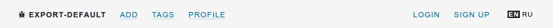

# Spring 4 MVC + ReactJS



Very light version of [stackoverflow](http://stackoverflow.com/) build by [ReactJS](https://facebook.github.io/react/) (client-side) and [Spring4](https://spring.io/) (server-side).

## Features

- Authorization system (by [json web token](https://jwt.io/))
- Questions, answers, users, reputation, tags and votes!
- Localization in react using [localizify](https://github.com/noveogroup-amorgunov/localizify)

## Intallation

**0** Clone repository!

```shell
$ git clone https://github.com/noveogroup-amorgunov/spring-mvc-react.git
```

**1** Change database driver (by default set for MySQL) and connections parameters (url, user and password) in `src/main/resources/app.properties`

**2** Change `jwt` secret key in `src/main/resources/app.properties` too (not nessasary)

**3** Create schema. After run application table will be created in auto mode. Follow example for MySQL

```sql
CREATE SCHEMA `spring-mvc-react` DEFAULT CHARACTER SET utf8 ;
```

**4** Install and build frontend dependencies 

```shell
$ cd src/main/webapp
$ npm install
$ npm install webpack -g # intstall webpack globally
$ npm run build # build bundle.js file
```

Use `npm run watch` for work in watch-mode. When you change some javascript file, here will be build new bundle.js

**5** Run server

```shell
$ mvn jetty:run
```
Access ```http://localhost:4017/spring4ajax```

To import this project into Eclipse IDE:

1. ```$ mvn eclipse:eclipse```
2. Import into Eclipse via **existing projects into workspace** option.
3. Done.
